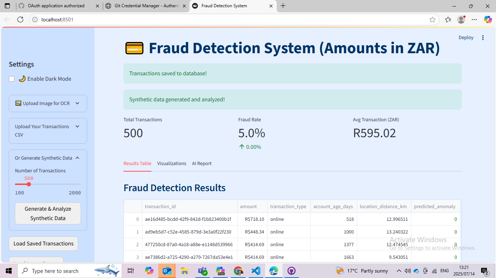

# Fraud Detection Simulator

A Streamlit-based AI solution that detects fraudulent transactions using machine learning and generates professional fraud reports powered by large language models.

---

##  Features

-  Upload or generate synthetic transaction data  
-  Anomaly detection with Isolation Forest (`scikit-learn`)  
-  Interactive visualizations with Plotly  
-  GPT-powered fraud report generation via OpenRouter  
-  Dark/Light mode support  
- OCR image input (optional via Tesseract)    
-  CSV-based local data storage (**SQLite support planned**)  

---

##  Technologies Used

| Category        | Tool / API                    |
|-----------------|-------------------------------|
| **Frontend**    | Streamlit                     |
| **ML Model**    | Isolation Forest (`scikit-learn`) |
| **NLP Engine**  | OpenRouter (`GPT-4o`)         |
| **Visualization** | Plotly                    |
| **OCR**         | Tesseract OCR (`pytesseract`) |
| **Data Storage**| CSV (initial) / SQLite (planned) |
| **Env Handling**| `python-dotenv`               |

---

##  Setup Instructions

### 1️⃣Clone the Repository

```bash
git clone https://github.com/your-username/fraud-simulator.git
cd fraud-simulator
2️⃣ Create & Activate a Virtual Environment
bash
Copy
Edit
python -m venv venv
# Activate:
# Windows
venv\Scripts\activate
# macOS/Linux
source venv/bin/activate
3️⃣ Install Dependencies
bash
Copy
Edit
pip install -r requirements.txt
4️⃣ Set Environment Variables
Create a .env file in the root directory with your OpenRouter token:

env
Copy
Edit
HF_API_TOKEN=your_huggingface_or_openrouter_token
5️⃣ Run the App
bash
Copy
Edit
streamlit run App.py

 Sample Screenshots


 Example Use Cases
Educational tool for fraud analytics training

Baseline financial anomaly detection simulator

AI demo integrating ML + NLP + OCR + TTS


 Roadmap
 GPT-powered report generation

 Dark mode toggle

 OCR image upload integration

 SQLite persistent storage

 Admin dashboard & session logs

 Contributing
Contributions are welcome! Here's how to contribute:

bash
Copy
Edit
# Fork the repo
# Create your feature branch
git checkout -b feature/your-feature

# Commit your changes
git commit -m "Add your feature"

# Push to GitHub
git push origin feature/your-feature

# Open a Pull Request
